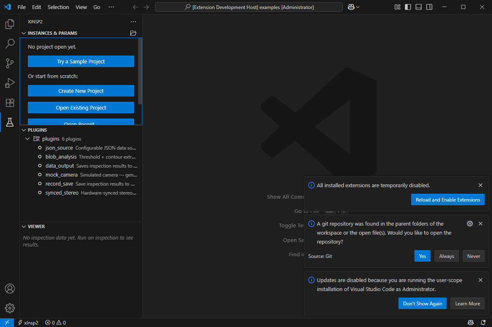
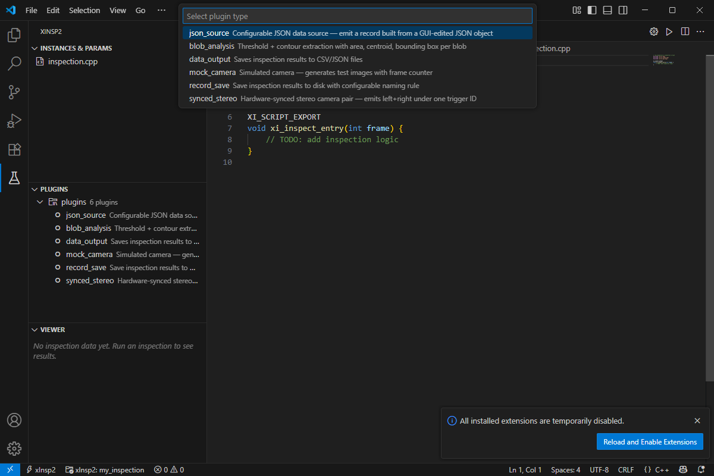
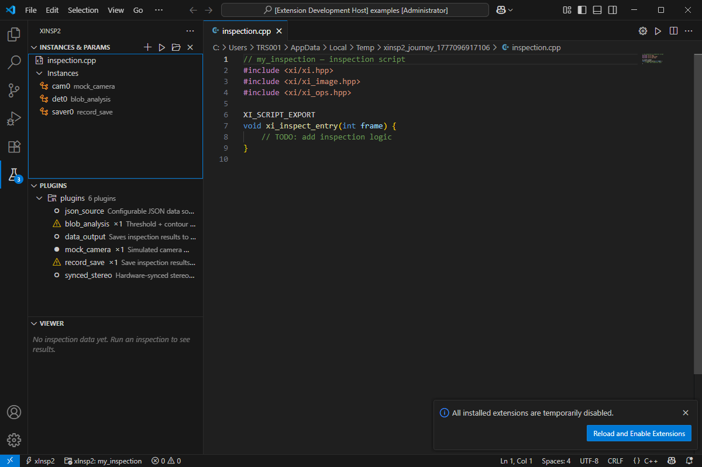
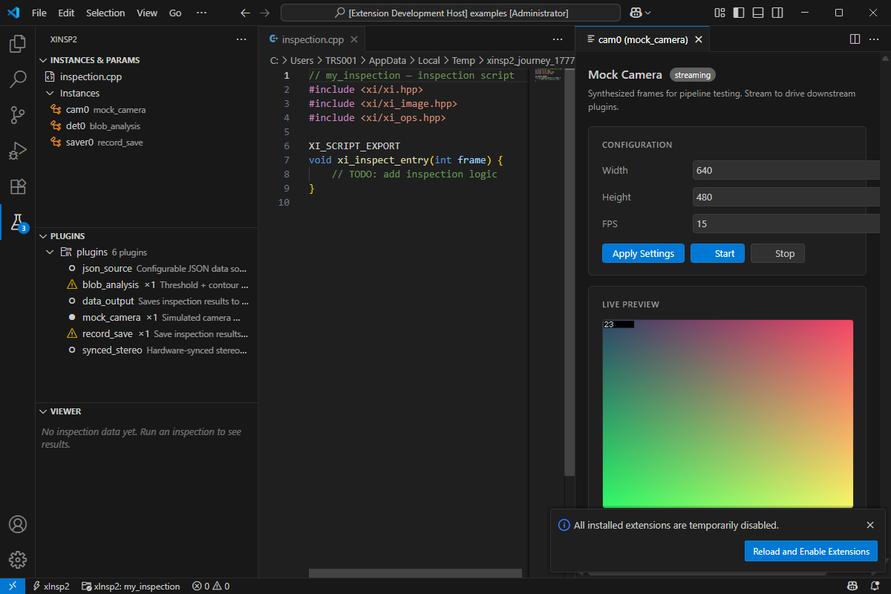
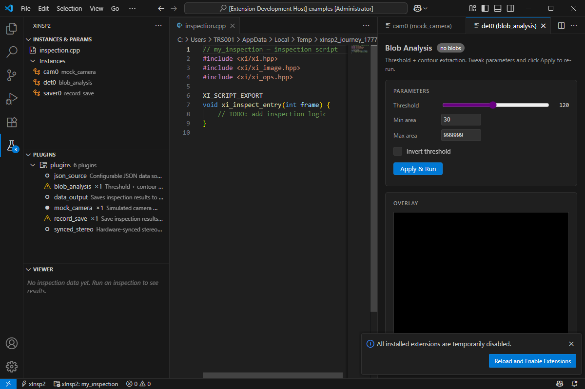
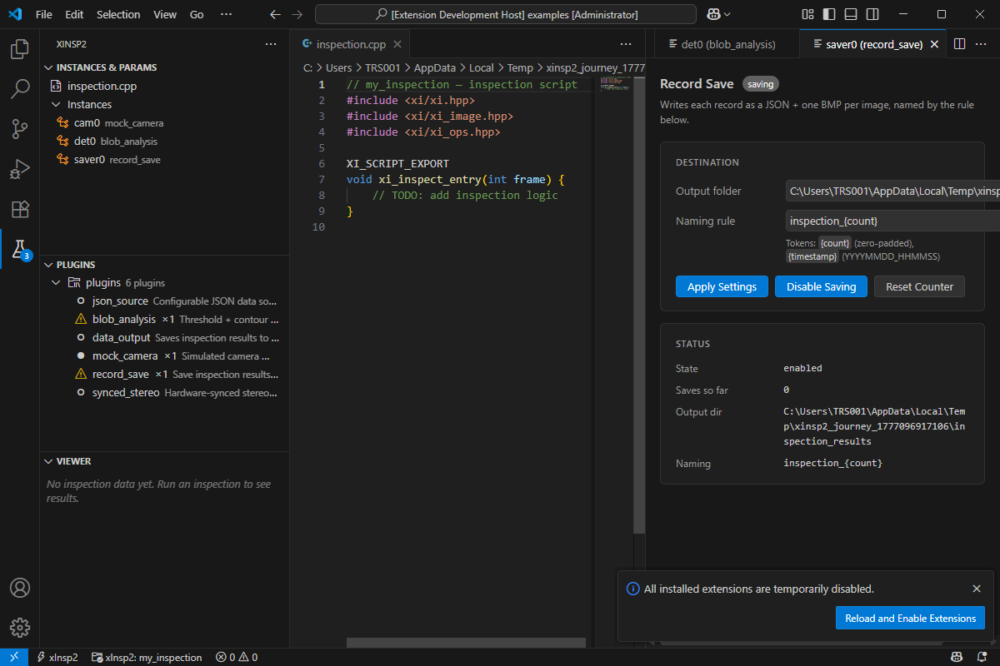
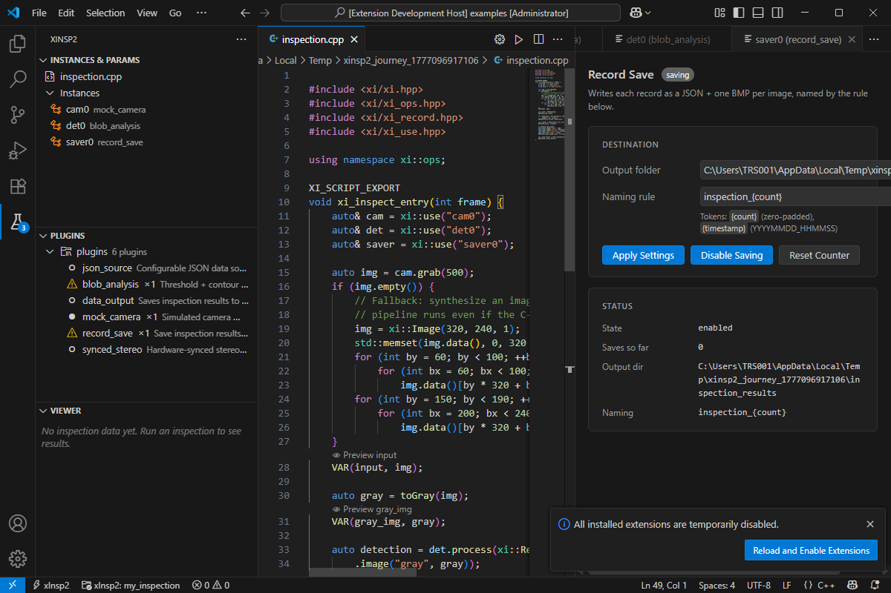
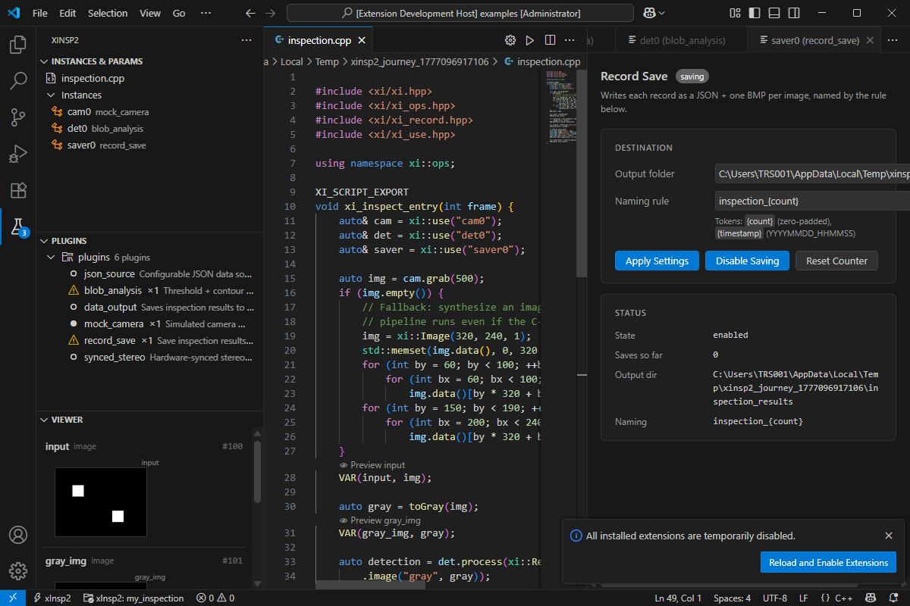

# xInsp2

**An HDevelop-style machine-vision inspection framework — written as plain
C++, edited in VS Code, wired over WebSockets.**

> You write one C++ file. xInsp2 gives you a live Variable Window, tunable
> sliders, hot-reload, crash isolation, a plugin SDK, multi-camera
> trigger correlation, record/replay, remote backend, and a headless
> production runner.

---

## The model

```cpp
#include <xi/xi.hpp>
#include <xi/xi_ops.hpp>
#include <xi/xi_use.hpp>

using namespace xi::ops;

xi::Param<int>    thresh {"threshold", 128, {0, 255}};
xi::Param<double> sigma  {"sigma",     2.0, {0.1, 10.0}};

XI_SCRIPT_EXPORT
void xi_inspect_entry(int frame) {
    auto& cam = xi::use("cam0");              // backend-managed instance
    auto& det = xi::use("detector0");         // survives hot-reload

    auto img = cam.grab(500);
    if (img.empty()) return;

    VAR(input, img);                          // tracked & visible in UI
    VAR(gray,  toGray(img));
    VAR(blur,  gaussian(gray, sigma));

    auto result = det.process(xi::Record()
        .image("gray", blur)
        .set("threshold", (int)thresh));      // slider value, no recompile

    VAR(detection, result);
    VAR(pass, result["blob_count"].as_int() <= 3);
}
```

Three primitives do all the heavy lifting:

| Primitive        | Role                                                       |
|------------------|------------------------------------------------------------|
| `xi::Instance<T>`| Persistent, UI-backed state (cameras, templates, models)   |
| `xi::Param<T>`   | Tunable value with a slider / picker in VS Code            |
| `VAR(name, expr)`| Track and publish an intermediate value for inspection     |

Parallelism is `xi::async(fn, args...)` + `Future<T>` with implicit
await. Trigger-correlated multi-camera capture is
`xi::current_trigger()`. **No node graph.** The script is the graph.

---

## Architecture

```
┌──────────────────────────────┐       ┌────────────────────────────────┐
│ xinsp-backend.exe            │       │ VS Code extension              │
│   ├─ plugin scan + cert      │       │   ├─ Instances / Params tree   │
│   ├─ native_plugin JIT dll   │  WS   │   ├─ CodeLens on .cpp          │
│   ├─ ImagePool (sharded)     │◀─────▶│   ├─ Viewer (vars + preview)   │
│   ├─ TriggerBus              │ JSON  │   ├─ Plugin UI webviews        │
│   ├─ WebSocket server        │+JPEG  │   └─ runMulticam / runRecord…  │
│   └─ SEH crash translator    │       │                                │
└──────────────────────────────┘       └────────────────────────────────┘
        ▲                 ▲
        │                 │ (any WS client — browser, CLI, remote PC)
        │                 │
        │        ┌────────┴────────────────┐
        │        │ xinsp-runner.exe        │  Headless. No WS. Takes a
        │        │   loads project.json,   │  project folder and writes
        │        │   compiles, runs N      │  a pass/fail JSON report.
        │        │   frames, writes report │
        │        └─────────────────────────┘
        │
   plugin DLLs (C ABI, cert.json'd)
   user inspection.dll (JIT-compiled)
```

Key design choices:

- **Stable C ABI for plugins.** No C++ types cross `xi_plugin_*` boundary —
  survives MSVC version drift.
- **Sharded refcounted ImagePool.** 16 shards, `shared_mutex`, 64-bit
  internal counter.
- **SEH → C++ exception translation.** Null deref, div/0, array overrun,
  C++ throw — all recoverable without killing the backend.
- **Hot-reload with state.** `xi::state()` serialises before DLL unload,
  restores after. Script edits are a one-file recompile.
- **TriggerBus.** 128-bit trigger ids; three correlation policies
  (`Any` / `AllRequired` / `LeaderFollowers`) for hardware-synced
  multi-camera capture.
- **Dependency-free host.** Only cJSON + stb_image_write vendored;
  OpenCV / IPP are optional behind `XINSP2_HAS_*`.

---

## Install — end users

The fastest way: grab the prebuilt zip from the
[Releases page](https://github.com/MDMTseng/xInsp2/releases/latest).

1. **Download** `xinsp2-<version>-win-x64.zip` and unzip somewhere stable
   (e.g. `C:\xinsp2`).
2. **Install the VS Code extension**: in VS Code, `Extensions` (Ctrl+Shift+X)
   → `…` menu → `Install from VSIX…` → pick
   `extension/xinsp2-<version>.vsix` from the unzipped folder.
3. **Verify**:

   ```bat
   C:\xinsp2\bin\xinsp-backend.exe --version
   ```

   should print `xinsp-backend <version> (<commit>)`.

The extension auto-spawns the backend on activation. If you put the
folder somewhere other than the dev tree, set the absolute path in
VS Code settings:

- `xinsp2.backendExe` = `C:\xinsp2\bin\xinsp-backend.exe`

That's it. No CMake, no MSVC, no Node required to **use** xInsp2 —
only to write/build new plugins.

---

## Usage walkthrough

This is the 10-step path our automated `runUserJourney` test takes —
build a project from zero, configure 3 instances, write a script, run
inspections, save outputs.

### 1. Open the xInsp2 sidebar

Click the beaker icon on the activity bar. The Welcome view shows up
with starter actions.



### 2. Add an instance

After clicking **Create New Project**, the **Instances & Params** view
opens. Hit `+` to add an instance — the QuickPick lists every
discovered plugin (cameras, detectors, savers, …).



Add three: `cam0` (mock_camera), `det0` (blob_analysis), `saver0`
(record_save). They show up in the tree with inline icons.



### 3. Configure cam0 — live preview

Click `cam0`'s gear icon. The mock_camera plugin's webview opens. Set
FPS, click **Start**, and watch the live JPEG stream in the preview pane.



### 4. Configure det0 — blob analysis

Slide threshold, set min/max area, click **Apply & Run**. The plugin's
canvas overlay highlights detected blobs.



### 5. Configure saver0 — wire up disk output

Set the output directory + naming rule, hit **Enable**.



### 6. Write the inspection script

`inspection.cpp` was created when you made the project. Edit it — same
buffer style as any C++ file (IntelliSense, save, format).

```cpp
#include <xi/xi.hpp>
#include <xi/xi_use.hpp>

XI_SCRIPT_EXPORT
void xi_inspect_entry(int frame) {
    auto& cam   = xi::use("cam0");
    auto& det   = xi::use("det0");
    auto& saver = xi::use("saver0");

    auto img = cam.grab(500);
    if (img.empty()) return;

    VAR(input, img);
    VAR(detection, det.process(xi::Record().image("gray", img)));
    saver.process(xi::Record().image("input", img));
}
```

### 7. Compile

Click the gear icon in the editor title bar (visible when on
`inspection.cpp`). Build runs in seconds, hot-reloads the DLL.



### 8. Run

Click the `▷` icon in the Instances view title bar (or hit **Ctrl+F5**).
Each `VAR()` lights up in the Variable Window with type-specific
renderers — numbers, booleans, image thumbnails, Record trees.



### 9. Headless production run

For factory deployment without VS Code, use `xinsp-runner.exe`:

```bat
bin\xinsp-runner.exe path\to\project --frames=1000 --output=today.json
```

The runner loads `project.json`, restores all instances, compiles
the script, runs N frames, and writes a JSON report — no WS, no UI,
no UI dependencies. Exit `0` if every frame ran clean.

### 10. Remote backend (LAN deployment)

On the factory PC:

```bat
xinsp-backend.exe --host=0.0.0.0 --port=7823 --auth=<shared-secret>
```

In VS Code on the developer laptop:

- `xinsp2.remoteUrl` = `ws://factory-pc.lan:7823`
- `xinsp2.authSecret` = `<shared-secret>`

The extension connects over the network instead of spawning locally.
Same UI, real-machine images.

---

## Build from source — developers

If you want to modify the framework itself (not just write plugins):

### Prerequisites

- Windows 10/11 (Linux build path WIP)
- CMake ≥ 3.16, MSVC 2019+ (or clang-cl)
- Node.js 18+ (extension build + tests)
- **Optional accelerators** (auto-detected; install any you want):
  - **OpenCV 4.x** at `C:\opencv\opencv\build` — default ops backend
  - **libjpeg-turbo** at `C:\libjpeg-turbo64` — fast JPEG encode (`winget install libjpeg-turbo.libjpeg-turbo.VC`)
  - **Intel IPP 2026+** at `C:\Intel\ipp\<ver>` — image-op SIMD acceleration

### Build

```bash
# Backend + runner
cmake -S backend -B backend/build -A x64 \
    -DXINSP2_HAS_OPENCV=ON \
    -DXINSP2_HAS_TURBOJPEG=ON \
    -DXINSP2_HAS_IPP=ON
cmake --build backend/build --config Release

# Plugins (mock_camera, blob_analysis, synced_stereo, …)
cmake -S plugins -B plugins/build -A x64
cmake --build plugins/build --config Release

# VS Code extension
cd vscode-extension && npm install && npm run build
```

Runtime DLLs (OpenCV / turbojpeg / IPP) are auto-copied next to
`xinsp-backend.exe` by the build — no PATH munging needed.

### Run in VS Code (dev mode)

Open the repo in VS Code and hit `F5`. An Extension Development Host
launches with xInsp2 wired up; the auto-detection finds the backend
under `backend/build/Release/`.

### Build a release zip

```bash
node tools/build_release.mjs
# → release/xinsp2-<version>-win-x64.zip
```

This is the same script that produced the file on the Releases page.

---

## What's in the box

| Component             | Purpose                                                     |
|-----------------------|-------------------------------------------------------------|
| `backend/`            | The core: `xi::*` headers, WS server, ImagePool, TriggerBus |
| `backend/src/service_main.cpp` | `xinsp-backend.exe` — full interactive server      |
| `backend/src/runner_main.cpp`  | `xinsp-runner.exe` — headless production runner    |
| `vscode-extension/`   | VS Code integration: TreeView, CodeLens, webviews, E2E      |
| `plugins/`            | Shipped plugins: `mock_camera`, `blob_analysis`, `data_output`, `json_source`, `record_save`, `threshold_op`, `synced_stereo` |
| `sdk/`                | Plugin SDK: `scaffold.mjs`, `cmake/` module, `template/`, `testing/` helpers, worked examples |
| `examples/`           | User-script examples (defect_detection, use_demo, …)        |
| `protocol/messages.md`| WebSocket wire-protocol reference                           |

---

## Features

### Inspection authoring

- **One-file scripts.** Include `<xi/xi.hpp>`; write a plain C++ function.
- **Variable Window.** Every `VAR(name, expr)` shows up live with a
  type-specific renderer (number, bool, string, Image preview, Record tree).
- **Live tuning.** `xi::Param<T>` sliders drive `set_param` directly; no
  recompile. `set_param` → next `run` picks up the new value.
- **Parallel ops.** `xi::async(fn, args...)` + `Future<T>` with implicit
  await. `ASYNC_WRAP(name)` to pre-wrap an operator.
- **Record type.** `rec["roi.x"].as_int(0)`, `rec["items[0].score"].as_double()`
  — path expressions, safe defaults, named-image bag, cJSON-backed.

### Operational

- **Hot-reload.** Save `.cpp` → backend recompiles → instance state
  survives (`xi::state()`, `get_def`/`set_def`).
- **Crash isolation.** SEH `_set_se_translator` wraps every script /
  plugin call site. A null deref in user code returns an error message;
  the backend stays up.
- **CodeLens.** `⚙ Configure` / `🎚 Tune` / `👁 Preview` on every
  `xi::use(...)` / `xi::Param<...>` / `VAR(...)` site.

### Multi-camera (TriggerBus)

- **`host->emit_trigger(source, tid, ts, images, count)`** — source
  plugins publish frames under a 128-bit trigger id.
- **Policies:** `Any` (fire every emit) / `AllRequired` (fire when all
  named sources emitted the same tid) / `LeaderFollowers` (fire on
  leader; attach latest followers).
- **Script API:** `xi::current_trigger().image("cam_left")`,
  `.id_string()`, `.timestamp_us()`, `.sources()`.
- **Reference plugin:** `plugins/synced_stereo/` emits paired left+right
  frames under one tid.

### Recording & replay

- **Observer-mode recorder.** `recording_start` installs a bus observer
  that serialises every `TriggerEvent` to disk without interrupting the
  live pipeline.
- **Replay.** `recording_replay` pushes events back through
  `emit_trigger`; the whole pipeline (sinks, correlators, scripts) sees
  them identically to the live run.
- **On-disk format.** `manifest.json` + per-image `.raw` files with a
  24-byte `XIMG` header (`0x58494D47`).

### Deployment

- **Remote backend.** `--host=0.0.0.0 --auth=<secret>` opens the bus to
  the network; clients send `Authorization: Bearer <secret>` in the WS
  handshake. Constant-time compare.
- **Headless runner.** `xinsp-runner.exe <project>` — no WS, no UI.
  Loads `project.json`, compiles the script, runs N frames, writes a
  JSON report. The production face of xInsp2.

### Plugins

Write a plugin in ~30 lines of C++:

```cpp
#include <xi/xi_abi.hpp>

class MyPlugin : public xi::Plugin {
public:
    using xi::Plugin::Plugin;
    xi::Record process(const xi::Record& input) override {
        int t = input["threshold"].as_int(128);
        auto out = xi::ops::threshold(input.get_image("gray"), t);
        return xi::Record().image("dst", out).set("t_used", t);
    }
};
XI_PLUGIN_IMPL(MyPlugin)
```

Scaffolding:

```bash
node <xinsp2>/sdk/scaffold.mjs ~/my_plugins/my_first_plugin
```

Every plugin passes an 8-test **baseline** (C ABI safety: create/destroy,
JSON round-trip, concurrent calls, empty input) on first load; a
`cert.json` caches the result. A failed baseline refuses to instantiate.

Full SDK docs: [`sdk/README.md`](sdk/README.md) and
[`sdk/GETTING_STARTED.md`](sdk/GETTING_STARTED.md).

---

## Repo map

```
xInsp2/
├── README.md                ← you are here
├── NewDeal.md               ← the stable architectural vision
├── FRAMEWORK.md             ← authoritative technical reference (20+ sections)
├── DEV_PLAN.md              ← milestone skeleton (M0–M10 + Post-M10 phases)
├── STATUS.md                ← weekly pulse; remaining work; decision log
├── TEST_PLAN.md             ← planned test coverage
├── TestAudit.md             ← test-coverage audit findings
├── protocol/
│   └── messages.md          ← WS wire-protocol spec
├── backend/
│   ├── include/xi/          ← 30+ headers (xi_abi, xi_async, xi_var, …)
│   ├── src/
│   │   ├── service_main.cpp ← xinsp-backend.exe (WS server)
│   │   └── runner_main.cpp  ← xinsp-runner.exe (headless)
│   ├── tests/               ← C++ unit tests (xi_core, record, protocol, …)
│   └── CMakeLists.txt
├── vscode-extension/        ← VS Code integration + Node E2E tests
├── plugins/                 ← shipped plugins (7 plugins)
├── sdk/                     ← plugin SDK (scaffold, cmake, template, examples)
└── examples/                ← user-script examples + crash_tests
```

---

## Testing matrix

| Layer                        | Command                                          | What it proves                                              |
|------------------------------|--------------------------------------------------|-------------------------------------------------------------|
| C++ unit                     | `backend/build/Release/test_xi_core.exe` (+ 4 more) | Core types & traits; ImagePool concurrency; Record paths |
| WS protocol                  | `node --test vscode-extension/test/ws_*.test.mjs` | Command surface, crash recovery, fragmentation, adversarial |
| Multi-camera correlation     | `node vscode-extension/test/runMulticam.mjs`     | `synced_stereo` pairs left+right under same tid, 17/17      |
| Record/replay                | `node vscode-extension/test/runRecordReplay.mjs` | Observer records → replay dispatches every event, 11/11     |
| Remote auth                  | `node vscode-extension/test/runRemoteAuth.mjs`   | Bearer accept/deny/401, back-compat, constant-time compare  |
| User journey (full VS Code)  | `node vscode-extension/test/runUserJourney.mjs`  | 10 steps, 24 screenshots, real webview + UI assertions      |
| Headless runner              | `node vscode-extension/test/runHeadlessRunner.mjs` | xinsp-runner.exe produces a correct per-frame JSON report |

---

## Status

**M0–M10 complete.** Stretch milestones S2 (auto-compile), S8
(recording/replay), S9 (remote backend), S10 (headless runner) shipping.
S1, S3, S4, S5, S6, S7 open.

See [STATUS.md](STATUS.md) for the week-by-week pulse + remaining LOW
bugs + stretch roadmap.

### Production hardening

All 4 CRITICAL + 8 HIGH + 10 MEDIUM audit findings resolved. Remaining
items are 7 LOW / polish. Details in STATUS.md.

---

## Documentation index

| Doc                                           | When to read it                                         |
|-----------------------------------------------|---------------------------------------------------------|
| [NewDeal.md](NewDeal.md)                      | "What is xInsp2 trying to be?"                          |
| [FRAMEWORK.md](FRAMEWORK.md)                  | Full technical reference (API, ABI, protocol, build)    |
| [DEV_PLAN.md](DEV_PLAN.md)                    | Milestone execution order                               |
| [STATUS.md](STATUS.md)                        | Current state, open work, decision log                  |
| [protocol/messages.md](protocol/messages.md)  | WebSocket wire-format spec                              |
| [sdk/README.md](sdk/README.md)                | Writing a plugin (full reference)                       |
| [sdk/GETTING_STARTED.md](sdk/GETTING_STARTED.md) | First-plugin-in-5-minutes walkthrough                |
| [TEST_PLAN.md](TEST_PLAN.md)                  | Planned test coverage; what each test proves            |

---

## License

See individual files for vendored library licenses (cJSON — MIT;
stb_image_write — public domain). Everything else is this project's own.
