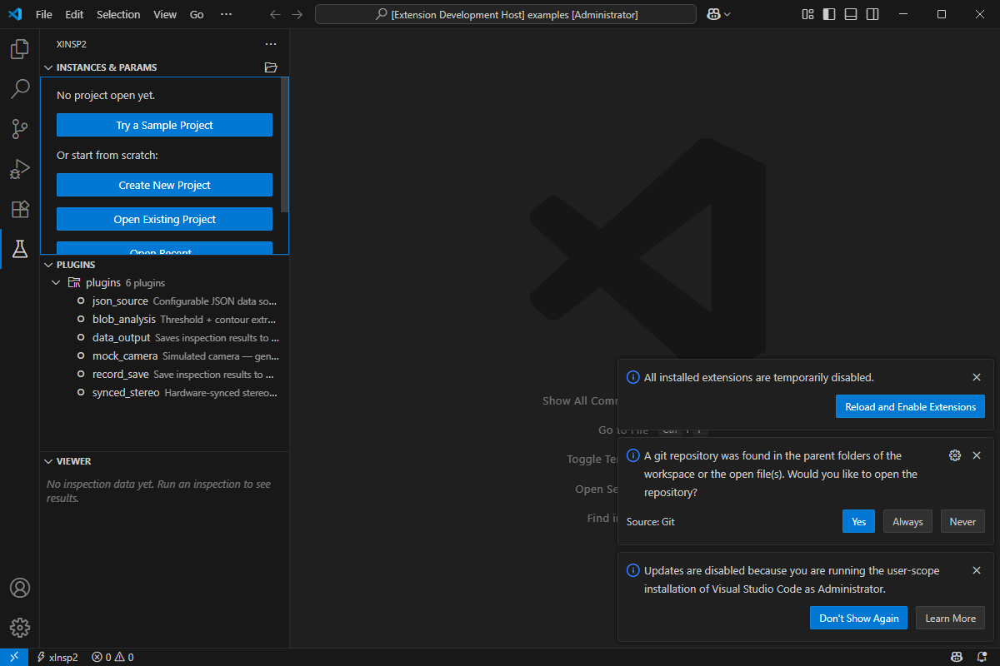
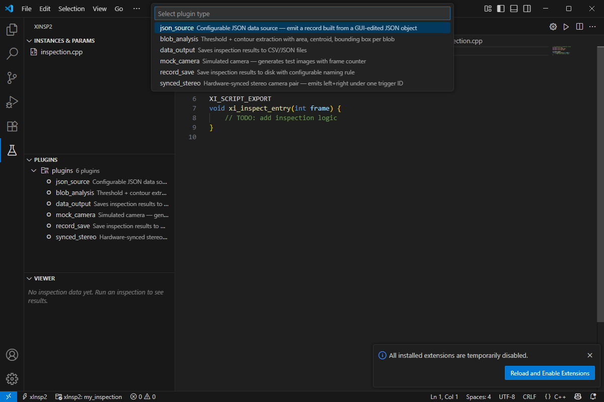
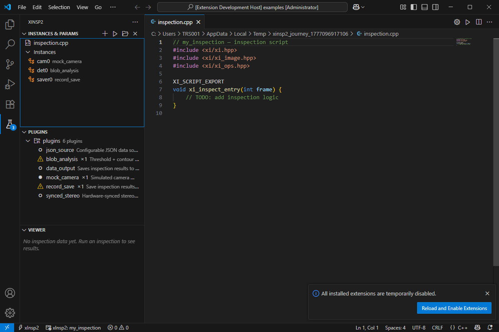
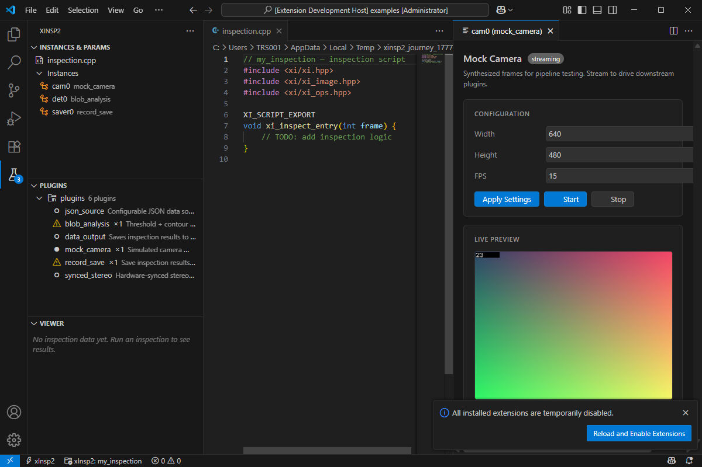
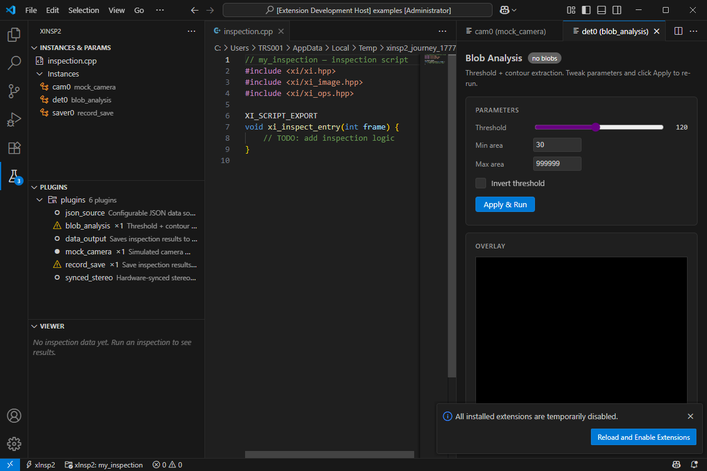
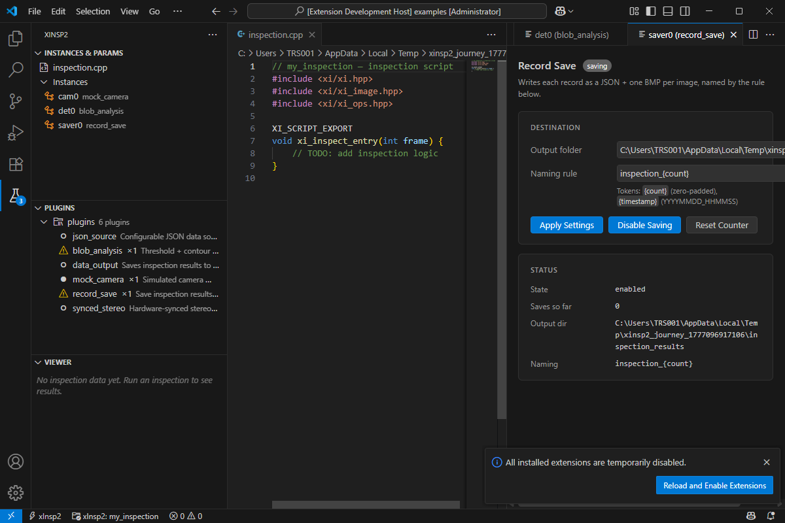
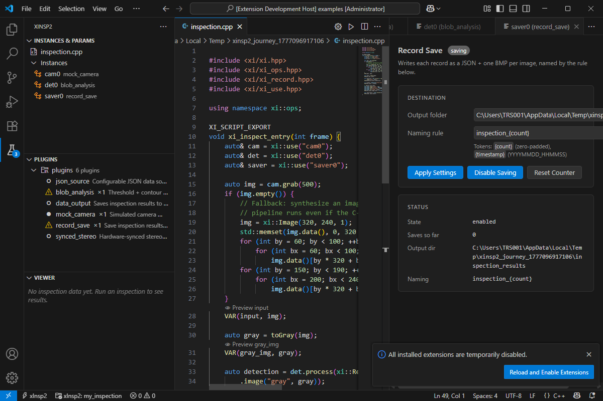
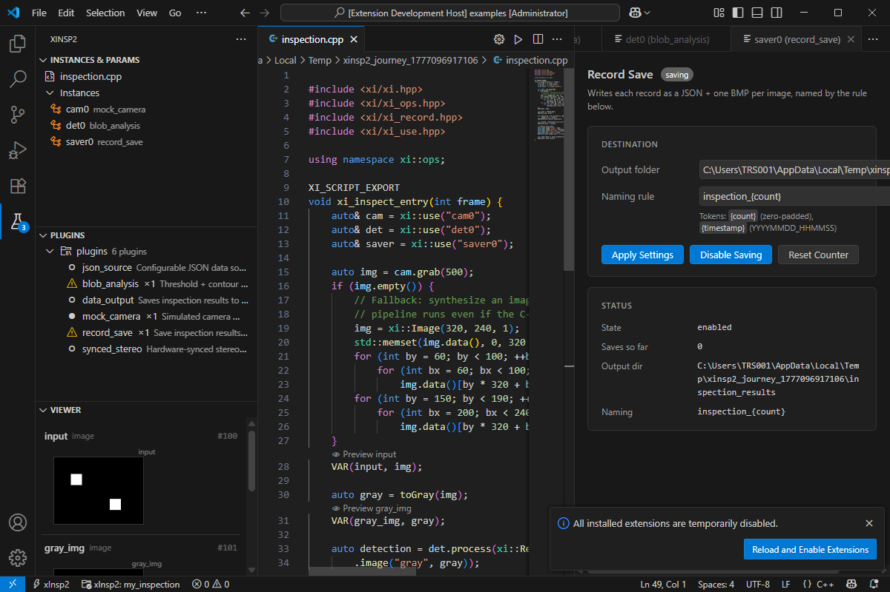

# xInsp2

**An HDevelop-style machine-vision inspection framework — written as plain
C++, edited in VS Code, wired over WebSockets.**

> You write one C++ file. xInsp2 gives you a live Variable Window, tunable
> sliders, hot-reload, crash isolation, a plugin SDK, multi-camera
> trigger correlation, record/replay, remote backend, and a headless
> production runner.

> 🚀 **New to the project?** Read **[`docs/overview.md`](docs/overview.md)**
> first — the mental model, the architecture in one picture, build-and-run on day
> one, and a guided index into all the docs.

---

## Core principles — the spine (do not drift)

**Read this before adding anything.** These are non-negotiable; every design
decision is measured against them. When they conflict with convenience,
convenience loses.

1. **Speed-first.** This is a machine-vision hot path. Zero-copy (images *and*
   JSON move by pointer through refcounted pools), no I/O or allocation on the
   per-frame path, measure before you trade it away. Ergonomic sugar never costs
   throughput.

2. **Minimal core.** The core does only what *nothing else can*: dispatch,
   lifecycle, crash-safety, refcounted pools, the frozen ABI. It holds **zero
   plugin-specific knowledge** — it never knows what `expose`, `cache`, or any
   camera *is*. Keep it small; resist every urge to grow it.

3. **Functionality-first, realized as plugins.** New capability is a **plugin**
   (or plugin composition), not a core feature. Multi-camera sync, record/replay,
   history/analytics, orchestration — all are plugins composed over the existing
   ABI. The core is a dumb hub; the plugins do the work.

> **The test — apply it to every proposed change:**
> *"Can this be a plugin?"* If yes, it **must** be. Touch the core **only** when
> the capability genuinely cannot live outside it — and even then, add the
> **smallest** primitive that unblocks the plugin, never the feature itself.

**ABI corollary:** the `xi_host_api` layout is **frozen**. A new host capability
ships as a **carved `get_interface(id, version)` interface**, never as a new struct
field. Breaking the layout is a deliberate, versioned, once-in-a-major event — not
a casual add. (See [`docs/internals/adr-001-host-api-freeze.md`](docs/internals/adr-001-host-api-freeze.md).)

If a change makes the core bigger, slower, or plugin-aware, it is probably wrong —
stop and find the plugin-shaped version.

---

## The model

```cpp
#include <xi/xi.hpp>           // xi::Image, xi::Param, xi::Record (OpenCV-free umbrella)
#include <xi/xi_cv.hpp>        // cv:: interop — only if the script calls cv:: directly
#include <xi/xi_use.hpp>
#include <xi/xi_result.hpp>    // xi::ok / xi::ng — the per-run verdict

xi::Param<int>    thresh {"threshold", 128, {0, 255}};
xi::Param<double> sigma  {"sigma",     2.0, {0.1, 10.0}};

// Explicit-trigger entry: the host hands the trigger in as `t` (no ambient state).
XI_INSPECT_ENTRY(t, frame) {
    (void)frame;
    auto& det = xi::use("detector0");         // survives hot-reload

    auto img = t.image("frame");              // frames pushed by the cam0 source
    if (img.empty()) { xi::result(0, "missing frame"); return; }  // NA

    cv::Mat gm, bm;
    cv::cvtColor(xi::as_cv_mat(img), gm, cv::COLOR_RGB2GRAY);
    int k = (int)(sigma * 2 + 1) | 1;
    cv::GaussianBlur(gm, bm, cv::Size(k, k), (double)sigma);
    xi::Image blur = xi::from_cv_mat(bm);

    auto result = det.process(xi::Record()
        .image("gray", blur)
        .set("threshold", (int)thresh));      // slider value, no recompile

    // Surface intermediates for the UI through the shipped `expose` plugin.
    xi::use("expose").process(xi::Record().set("$channel", "detection").image("input", img));

    if (result["blob_count"].as_int() <= 3) xi::ok(1, "pass");
    else                                    xi::ng(1, "too many blobs");
}
```

Three primitives do all the heavy lifting:

| Primitive        | Role                                                       |
|------------------|------------------------------------------------------------|
| `xi::Instance<T>`| Persistent, UI-backed state (cameras, templates, models)   |
| `xi::Param<T>`   | Tunable value with a slider / picker in VS Code            |
| `xi::use("expose")`| Surface an intermediate value/image for inspection in the UI |

Parallelism is `xi::async(fn, args...)` + `Future<T>` with implicit
await. Trigger-correlated multi-camera capture is
`xi::current_trigger()`. **Script-first authoring.** A read-only
pipeline graph view (`xinsp2.openPipelineGraph`) is available, but the
script is the source of truth — there is no graph-based authoring
editor.

---

## Architecture

```
┌──────────────────────────────┐       ┌────────────────────────────────┐
│ xinsp-backend.exe            │       │ VS Code extension              │
│   ├─ plugin scan + cert      │       │   ├─ Instances / Params tree   │
│   ├─ native_plugin JIT dll   │  WS   │   ├─ CodeLens on .cpp          │
│   ├─ ImagePool (sharded)     │◀─────▶│   ├─ Viewer (vars + preview)   │
│   ├─ TriggerBus              │ JSON  │   ├─ Plugin UI webviews        │
│   ├─ WebSocket server        │+JPEG  │   └─ runMulticam / runRecord…  │
│   └─ SEH crash translator    │       │                                │
└──────────────────────────────┘       └────────────────────────────────┘
        ▲                 ▲
        │                 │ (any WS client — browser, CLI, remote PC)
        │                 │
        │        ┌────────┴────────────────┐
        │        │ xinsp-runner.exe        │  Headless. No WS. Takes a
        │        │   loads project.json,   │  project folder and writes
        │        │   compiles, runs N      │  an execution/crash JSON
        │        │   frames, writes report │  report (per-frame verdicts).
        │        └─────────────────────────┘
        │
   plugin DLLs (C ABI, trusted load)
   user inspect.dll (JIT-compiled)
```

Key design choices:

- **Stable C ABI for plugins.** No C++ types cross `xi_plugin_*` boundary —
  survives MSVC version drift.
- **Uniform keyed Pack data plane.** Data moves as sealed **Packs** — keyed,
  typed entries (images, scalars, nested trees) over one canonical msgpack
  profile, byte-identical in memory, on the wire (**XEX1-v3**), and on disk
  (`.xex1`). Every shipped plugin speaks it through a **bilingual door**
  beside the legacy `xi::Record` path while that path winds down.
- **Shared heavy work is a lib plugin.** The capability plane: a lib plugin
  registers named capabilities (e.g. `plugins/imgcodec`'s `xi.jpeg.encode` —
  one deduplicated encode serves every consumer), and other plugins call it
  by name through a host-forwarded funnel with the same crash attribution
  and quarantine as every other boundary.
- **Sharded refcounted ImagePool.** 16 shards, `shared_mutex`, 64-bit
  internal counter.
- **SEH → C++ exception translation.** Null deref, div/0, array overrun,
  C++ throw — all recoverable without killing the backend.
- **Hot-reload with state.** Cross-frame script state lives in `xi::kv()`
  (a flat typed key-value store, canonical msgpack) — captured before DLL
  unload, restored after, schema-gated with an opt-in migrate hook; the
  legacy `xi::state()` JSON channel rides beside it until the cut. Script
  edits are a one-file recompile.
- **Dispatch.** Sources `emit_record` (images + metadata under a 128-bit
  trigger id); the host dispatches one inspection per emit. Multi-camera
  correlation is a gathering plugin (e.g. `synced_stereo`), not a policy.
- **Lean host.** Only yyjson + stb_image vendored. **OpenCV is required**
  (image ops + every script/plugin force-includes it); libjpeg-turbo and
  IPP are optional accelerators behind `XINSP2_HAS_*`.

---

## Install — end users

The fastest way: grab the prebuilt zip from the
[Releases page](https://github.com/MDMTseng/xInsp2/releases/latest).

1. **Download** `xinsp2-<version>-win-x64.zip` and unzip somewhere stable
   (e.g. `C:\xinsp2`).
2. **Install the VS Code extension**: in VS Code, `Extensions` (Ctrl+Shift+X)
   → `…` menu → `Install from VSIX…` → pick
   `extension/xinsp2-<version>.vsix` from the unzipped folder.
3. **Verify**:

   ```bat
   C:\xinsp2\bin\xinsp-backend.exe --version
   ```

   should print `xinsp-backend <version> (<commit>)`.

The extension auto-spawns the backend on activation. If you put the
folder somewhere other than the dev tree, set the absolute path in
VS Code settings:

- `xinsp2.backendExe` = `C:\xinsp2\bin\xinsp-backend.exe`

No CMake or Node is needed just to **run** xInsp2. Note, however, that
the backend compiles the inspection script (and project-local plugins)
on the fly with `cl.exe`, so the **MSVC C++ toolchain and OpenCV must be
present at runtime** unless you ship pre-compiled script/plugin DLLs for a
locked production line. See [`docs/guides/build-and-run.md`](docs/guides/build-and-run.md)
for the full per-machine setup, and the in-editor **Project Settings → C++
Toolchain** panel to verify a machine has everything (it warns on missing or
wrong paths and lets you pin per-project overrides).

---

## Usage walkthrough

This is the 10-step path our automated `runUserJourney` test takes —
build a project from zero, configure 3 instances, write a script, run
inspections, save outputs.

### 1. Open the xInsp2 sidebar

Click the beaker icon on the activity bar. The Welcome view shows up
with starter actions.



### 2. Add an instance

After clicking **Create New Project**, the **Instances & Params** view
opens. Hit `+` to add an instance — the QuickPick lists every
discovered plugin (cameras, detectors, savers, …).



Add three: `cam0` (mock_camera), `det0` (blob_analysis), `saver0`
(record_save). They show up in the tree with inline icons.



### 3. Configure cam0 — live preview

Click `cam0`'s gear icon. The mock_camera plugin's webview opens. Set
FPS, click **Start**, and watch the live JPEG stream in the preview pane.



### 4. Configure det0 — blob analysis

Slide threshold, set min/max area, click **Apply & Run**. The plugin's
canvas overlay highlights detected blobs.



### 5. Configure saver0 — wire up disk output

Set the output directory + naming rule, hit **Enable**.



### 6. Write the inspection script

`inspect.cpp` was created when you made the project. Edit it — same
buffer style as any C++ file (IntelliSense, save, format).

```cpp
#include <xi/xi.hpp>
#include <xi/xi_use.hpp>
#include <xi/xi_result.hpp>

XI_INSPECT_ENTRY(t, frame) {
    (void)frame;
    auto& det   = xi::use("det0");
    auto& saver = xi::use("saver0");

    auto img = t.image("frame");           // frames pushed by the cam0 source
    if (img.empty()) { xi::result(0, "missing frame"); return; }  // NA

    auto detection = det.process(xi::Record().image("gray", img));
    saver.process(xi::Record().image("input", img));

    // Surface the input for the UI via the shipped `expose` plugin.
    xi::use("expose").process(xi::Record().set("$channel", "input").image("input", img));
    xi::ok(1, "done");
}
```

### 7. Compile

Click the gear icon in the editor title bar (visible when on
`inspect.cpp`). Build runs in seconds, hot-reloads the DLL.



### 8. Run

Click the `▷` icon in the Instances view title bar (or hit **Ctrl+F5**).
Each channel you push through `xi::use("expose")` lights up in the
Variable Window with type-specific renderers — numbers, booleans, image
thumbnails, Record trees.



### 9. Headless production run

For factory deployment without VS Code, use `xinsp-runner.exe`:

```bat
bin\xinsp-runner.exe path\to\project --frames=1000 --output=today.json
```

The runner loads `project.json`, restores all instances, compiles
the script, runs N frames, and writes a JSON report — no WS, no UI,
no UI dependencies. Exit `0` if every frame ran clean.

> **What the report captures:** both an **execution/crash log and a verdict
> log**. Each frame entry records its verdict `code` / `class`
> (ok / ng / na / no_verdict / crashed) / `msg`, the summary carries a
> `counts` tally per class plus the final `health` state, and the process
> **exit code still reflects infra/crash status only** — exit `0` means
> "every frame dispatched without crashing", not "every part passed"; read
> `counts` for the parts.

### 10. Remote backend (LAN deployment)

On the factory PC:

```bat
xinsp-backend.exe --host=0.0.0.0 --port=7823 --auth=<shared-secret>
```

In VS Code on the developer laptop:

- `xinsp2.remoteUrl` = `ws://factory-pc.lan:7823`
- `xinsp2.authSecret` = `<shared-secret>`

The extension connects over the network instead of spawning locally.
Same UI, real-machine images.

---

## Build from source — developers

If you want to modify the framework itself (not just write plugins):

### Prerequisites

- Windows 10/11 (Linux build path WIP)
- **MSVC 2019+** with the *Desktop development with C++* workload (or clang-cl) — `cl.exe` + `vcvars64.bat` + Windows SDK
- **OpenCV 4.x** at `C:\opencv\opencv\build` (or set `OpenCV_DIR`) — **required** (`find_package(OpenCV REQUIRED)`; every script/plugin force-includes `<opencv2/opencv.hpp>`)
- CMake ≥ 3.16
- Node.js 18+ (extension build + tests)
- **Optional accelerators** (auto-detected; install any you want):
  - **libjpeg-turbo** at `C:\libjpeg-turbo64` — fast JPEG encode (`winget install libjpeg-turbo.libjpeg-turbo.VC`)
  - **Intel IPP 2026+** at `C:\Intel\ipp\<ver>` — image-op SIMD acceleration

See [`docs/guides/build-and-run.md`](docs/guides/build-and-run.md) for step-by-step new-machine setup.

### Build

```bash
# Backend + runner
cmake -S backend -B backend/build -A x64 \
    -DXINSP2_HAS_OPENCV=ON \
    -DXINSP2_HAS_TURBOJPEG=ON \
    -DXINSP2_HAS_IPP=ON
cmake --build backend/build --config Release

# Plugins (mock_camera, blob_analysis, synced_stereo, …)
cmake -S plugins -B plugins/build -A x64
cmake --build plugins/build --config Release

# VS Code extension
cd vscode-extension && npm install && npm run build
```

Runtime DLLs (OpenCV / turbojpeg / IPP) are auto-copied next to
`xinsp-backend.exe` by the build — no PATH munging needed.

### Run in VS Code (dev mode)

Open the repo in VS Code and hit `F5`. An Extension Development Host
launches with xInsp2 wired up; the auto-detection finds the backend
under `backend/build/Release/`.

### Build a release zip

```bash
node tools/build_release.mjs
# → release/xinsp2-<version>-win-x64.zip
```

This is the same script that produced the file on the Releases page.

---

## What's in the box

| Component             | Purpose                                                     |
|-----------------------|-------------------------------------------------------------|
| `backend/`            | The core: `xi::*` headers, WS server, ImagePool, TriggerBus |
| `backend/src/service_main.cpp` | `xinsp-backend.exe` — full interactive server      |
| `backend/src/runner_main.cpp`  | `xinsp-runner.exe` — headless production runner    |
| `vscode-extension/`   | VS Code integration: TreeView, CodeLens, webviews, E2E      |
| `plugins/`            | Shipped plugins: `mock_camera`, `blob_analysis`, `data_output`, `json_source`, `record_save`, `threshold_op`, `synced_stereo` |
| `sdk/`                | Plugin SDK: `scaffold.mjs`, `cmake/` module, `template/`, `testing/` helpers, worked examples |
| `examples/`           | User-script examples (defect_detection, use_demo, …)        |
| `docs/`               | Architecture, status, testing, protocol reference, guides   |

---

## Features

### Inspection authoring

- **One-file scripts.** Include `<xi/xi.hpp>`; write a plain C++ function.
- **Variable Window.** Every channel pushed through `xi::use("expose")`
  shows up live with a type-specific renderer (number, bool, string,
  Image preview, Record tree).
- **Live tuning.** `xi::Param<T>` sliders drive `set_param` directly; no
  recompile. `set_param` → next `run` picks up the new value.
- **Parallel ops.** `xi::async(fn, args...)` + `Future<T>` with implicit
  await. `ASYNC_WRAP(name)` to pre-wrap an operator.
- **Record type.** `rec["roi.x"].as_int(0)`, `rec["items[0].score"].as_double()`
  — path expressions, safe defaults, named-image bag, yyjson-backed.
- **Pack, script-side.** `t.pack()` hands the frame to the script as a sealed
  Pack (typed reads, zero-copy image spans); `xi::ScriptPackBuilder` builds
  new ones; `xi::use("det0").process(pack)` chains them through plugin doors;
  `xi::use("expose").push(pack)` surfaces them to the UI in frame order.

### Operational

- **Hot-reload.** Save `.cpp` → backend recompiles → instance state
  survives (`xi::state()`, `get_def`/`set_def`).
- **Crash isolation.** SEH `_set_se_translator` wraps every script /
  plugin call site. A null deref in user code returns an error message;
  the backend stays up.
- **CodeLens.** `⚙ Configure` / `🎚 Tune` / `👁 Preview` on every
  `xi::use(...)` / `xi::Param<...>` site.

### Image sources & dispatch

- **`xi::emit_record(host, source, record)`** — source plugins push a
  record (images + metadata) into the pipeline; the host stamps a 128-bit
  trigger id and dispatches the inspection once per emit.
- **Script API:** `xi::current_trigger().image("frame")`, `.id_string()`,
  `.meta()`, `.sources()`.
- **Multi-source correlation** (e.g. a synced stereo pair) is plugin
  composition, not a bus policy: a **gathering plugin** subscribes to the
  sources, combines their frames into one record, and emits that. See
  `examples/stereo_sync/`.

### Recording & replay

- **Replay is a plugin.** `record_save` persists runs as **XEX1-v3** `.xex1`
  files — the same canonical bytes as memory and wire — and the
  `record_replay` source re-emits them through the standard door: a
  byte-lossless record → save → replay loop for regression tests and
  off-line tuning (`examples/qa_pack_record_replay/`). The `cache` plugin
  is the in-RAM variant — capture live frames, re-inspect on a hot param
  change. See `examples/buffer_replay_demo/`.

### Deployment

- **Remote backend.** `--host=0.0.0.0 --auth=<secret>` opens the bus to
  the network; clients send `Authorization: Bearer <secret>` in the WS
  handshake. Constant-time compare.
- **Headless runner.** `xinsp-runner.exe <project>` — no WS, no UI.
  Loads `project.json`, compiles the script, runs N frames, writes a
  JSON report. The production face of xInsp2. The report carries both the
  **execution/crash log** (frame count, crash count, timing) and the
  per-frame **verdict**: each frame records its `code`, `class`
  (ok / ng / na / no_verdict / crashed), and `msg`, with a summary
  `counts` tally. The process **exit code** still reflects infra/crash
  status only, not the verdict roll-up — grep the report for pass/fail.

### Plugins

Write a plugin in ~30 lines of C++:

```cpp
#include <xi/xi_abi.hpp>

class MyPlugin : public xi::Plugin {
public:
    using xi::Plugin::Plugin;
    xi::Record process(const xi::Record& input) override {
        int t   = input["threshold"].as_int(128);
        auto in = input.get_image("gray");
        auto out = pool_image(in.width, in.height, 1);
        cv::threshold(in.as_cv_mat(), out.as_cv_mat(), t, 255, cv::THRESH_BINARY);
        return xi::Record().image("dst", out).set("t_used", t);
    }
};
XI_PLUGIN_IMPL(MyPlugin)
```

Scaffolding:

```bash
node <xinsp2>/sdk/scaffold.mjs ~/my_plugins/my_first_plugin
```

Plugins are **trusted** — the host loads the DLL straight through after an
ABI-version check (no certification gate). Write your own tests with
`xi_test.hpp` to gain confidence; nothing blocks a plugin from loading.

Full SDK docs: [`sdk/README.md`](sdk/README.md) and
[`sdk/GETTING_STARTED.md`](sdk/GETTING_STARTED.md).

---

## Repo map

```
xInsp2/
├── README.md                ← you are here
├── docs/
│   ├── architecture.md      ← technical map: components, data flow, lifecycles
│   ├── status.md            ← what's shipping / WIP / planned (no parallel files)
│   ├── testing.md           ← test surface + how to run + how to add
│   ├── protocol.md          ← WebSocket wire-format reference
│   ├── guides/              ← task-shaped onboarding (adding a plugin, debugging, …)
│   ├── reference/           ← per-API references (host_api, plugin-abi, instance-model, …)
│   └── archive/             ← historical snapshots (M0 plan, retired audits)
├── backend/
│   ├── include/xi/          ← 50+ headers (xi_abi, xi_async, xi_var, …)
│   ├── src/
│   │   ├── service_main.cpp ← xinsp-backend.exe (WS server)
│   │   └── runner_main.cpp  ← xinsp-runner.exe (headless)
│   ├── tests/               ← C++ unit tests (xi_core, record, protocol, …)
│   └── CMakeLists.txt
├── vscode-extension/        ← VS Code integration + Node E2E tests
├── plugins/                 ← shipped plugins
├── sdk/                     ← plugin SDK (scaffold, cmake, template, examples)
└── examples/                ← user-script examples + crash_tests
```

---

## Testing matrix

| Layer                        | Command                                          | What it proves                                              |
|------------------------------|--------------------------------------------------|-------------------------------------------------------------|
| C++ unit                     | `ctest --test-dir backend/build -C Release` (12 targets) | Core types & traits; ImagePool concurrency; Record paths |
| WS protocol                  | `node --test vscode-extension/test/ws_*.test.mjs` | Command surface, crash recovery, fragmentation, adversarial |
| Multi-camera correlation     | `node vscode-extension/test/runMulticam.mjs`     | `synced_stereo` pairs left+right under same tid, 17/17      |
| Record/replay                | `node vscode-extension/test/runRecordReplay.mjs` | Observer records → replay dispatches every event, 11/11     |
| Remote auth                  | `node vscode-extension/test/runRemoteAuth.mjs`   | Bearer accept/deny/401, back-compat, constant-time compare  |
| User journey (full VS Code)  | `node vscode-extension/test/runUserJourney.mjs`  | 10 steps, 24 screenshots, real webview + UI assertions      |
| Headless runner              | `node vscode-extension/test/runHeadlessRunner.mjs` | xinsp-runner.exe produces a correct per-frame JSON report |

---

## Status

See [`docs/roadmap/README.md`](docs/roadmap/README.md) for what's shipping and the
locked-in decision log. Process isolation + SHM were removed 2026-05;
all plugins run in-process.

---

## Versioning & compatibility

xInsp2 ships as several packages that **version independently** — each moves
on its own SemVer track, so a bump in one does not force a bump in the others.
There is no single monolithic product version.

| Package                      | Version | Track                                   |
|------------------------------|---------|-----------------------------------------|
| `xinsp-backend` (+ runner)   | 0.2.0   | Native core: WS server, ImagePool, ABI  |
| VS Code extension            | 0.2.0   | Editor integration (`.vsix`)            |
| `ui-components`              | 0.1.0   | Shared webview UI kit                   |
| Python client               | 0.3.0   | WS protocol client library              |

**The one contract that actually gates compatibility is the plugin ABI**
(`xi_host_api`, currently **frozen at v11** — see
[`docs/internals/adr-001-host-api-freeze.md`](docs/internals/adr-001-host-api-freeze.md)).
A plugin compiled against an ABI version keeps loading as long as the backend
publishes that version; package SemVer numbers do not govern plugin loading.

**Known-compatible set** (what we build and test together today):

| Backend | Extension | ui-components | Python client | ABI |
|---------|-----------|---------------|---------------|-----|
| 0.2.0   | 0.2.0     | 0.1.0         | 0.3.0         | v11 |

All packages are **pre-1.0**: minor bumps may still carry breaking changes,
and there are no external consumers yet (first-party only). Pin to the
known-compatible row above until we cut 1.0 and adopt a formal support policy.

**Machine-readable, not just prose.** The known-compatible row above is mirrored
in [`tools/compat-matrix.json`](tools/compat-matrix.json) — the single authority
for the tested-together set. Every release zip also carries a
`compat-manifest.json` at its root (generated by
[`tools/compat_manifest.mjs`](tools/compat_manifest.mjs) at build time), which
records the exact backend version, git sha, plugin-ABI + min-compat, WS-protocol
abi + command count + contract schemas, and this known-compatible set — all read
from their real sources, nothing hand-typed. So a target machine can answer
"what am I running, and what does it claim compatibility with" from the artifact
alone, and a zip-swap rollback carries its identity with it. The `compat_manifest`
ctest fails if the matrix drifts from the real per-package version sources, and
warns if this table drifts from the matrix.

---

## Documentation index

Pick the entry point closest to your task — every doc tells you the
next jump.

| If you need to… | Read |
|---|---|
| Understand what xInsp2 is | This README |
| See the technical map | [`docs/overview.md`](docs/overview.md) |
| Know what's shipping vs WIP | [`docs/roadmap/README.md`](docs/roadmap/README.md) |
| Run / add tests | [`docs/testing.md`](docs/testing.md) |
| Drive the WebSocket protocol | [`docs/reference/ws-protocol.md`](docs/reference/ws-protocol.md) |
| Add a plugin | [`docs/guides/write-a-plugin.md`](docs/guides/write-a-plugin.md) |
| Write an inspection script | [`docs/guides/write-a-script.md`](docs/guides/write-a-script.md) |
| Debug a crash | [`docs/guides/debug.md`](docs/guides/debug.md) |
| Extend the VS Code UI | [`docs/guides/extend-the-ui.md`](docs/guides/extend-the-ui.md) |
| Look up `host_api` / ABI | [`docs/reference/`](docs/reference/) |
| Browse worked examples | [`sdk/examples/`](sdk/examples/) + [`sdk/README.md`](sdk/README.md) |
| First plugin in 5 minutes | [`sdk/GETTING_STARTED.md`](sdk/GETTING_STARTED.md) |

---

## License

See individual files for vendored library licenses (yyjson — MIT;
stb_image_write — public domain). Everything else is this project's own.
