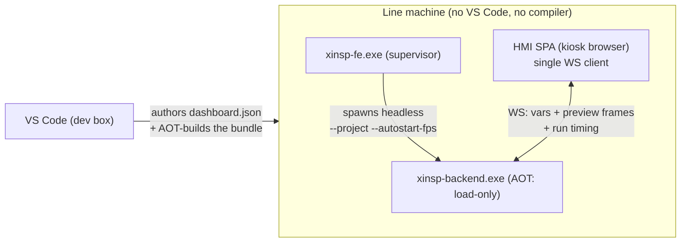

# Production HMI + standalone package export — design

> **Status: v1 shipped.** The RUN-mode SPA + compose + cards + the AOT export
> bundle are built (`hmi/`, `tools/export_bundle.py`; see
> [`deployment.md`](../guides/deploy.md) and [`../../hmi/README.md`](../../hmi/README.md)).
> Phase 2 (multi-client, deeper compose polish) is not scheduled. This doc keeps
> the design rationale. Assessment date 2026-06-04.

## The gap

Everything today is **dev-side**: VS Code drives the backend, the viewer/instance
UIs are for authoring. There is no **operator interface** for a running line, and
no **standalone deployable package** that runs without VS Code + the SDK. This
doc designs both:

1. A **production HMI** — a browser SPA the operator runs full-screen, showing a
   composed layout of selected image outputs, NG/OK verdicts, and SPC / speed /
   quality charts.
2. A **standalone package export** — FE + BE + the **AOT-precompiled** project +
   the HMI SPA + a launcher, with no compiler / SDK / VS Code on the line.

The data plumbing already exists (see "What we reuse"), so this layer is mostly a
**display + packaging** layer, not new compute.

## Locked decisions

- **HMI is a standalone browser SPA**, the single WS client of the (FE-supervised)
  backend. Zero-install; runs in a kiosk browser.
- **The composer lives in the SPA** as a **recursive split-pane** layout (not
  free drag/drop): you click a pane to split it vertically/horizontally or assign
  a card, and drag the dividers to resize. A binary split-tree — no overlap, fills
  the screen, simplest interaction, best fit for a fixed kiosk. Two modes:
  **Compose** (edit) and **Run** (operator, read-only). Layout persists to
  `dashboard.json` in the project.
- **The inspection script is the single source of truth for data.** The script
  computes verdict + metrics + overlay data in C++ and emits them as `VAR`s. The
  HMI does **no computation** — cards just *bind to a var name*. No expression
  engine in the HMI.
- **Cards are web components** — both built-in and custom, same contract. Cards
  never open their own WS; the SPA host feeds them live state.
- **A plugin can contribute three visual surfaces**, all web components sharing
  the vars/exchange contract: a dev **config UI** (`ui`, exists today), a
  production **card** (`card`), and an **overlay renderer** (`overlay`).
- **Overlays are vector layers**, decoupled from the base image: the plugin/script
  emits overlay *data* (JSON), an overlay renderer draws it; multiple overlays
  stack on one image card.
- **Production runs AOT-precompiled** — the line loads prebuilt script/plugin
  binaries, no compiler present (see `linux-port.md` → AOT bundle).

## Architecture



- FE autostarts BE headless and supervises it (existing `fe_main.cpp` +
  `--project/--autostart-fps`). On the line there is no dev client, so the **HMI is
  the single WS client** — fits the existing single-client protocol with no change.
- The HMI subscribes to the existing streams and renders per `dashboard.json`.

## What we reuse (already on the wire)

| Need | Already provides it |
|---|---|
| Per-pass values + image refs | `vars` message (`items[]` with values + image `gid`) |
| Image pixels | binary **preview frames** (gid-keyed) |
| Cycle time / throughput | `run_finished` event carries `ms` |
| Backfill charts on connect / SPC windows | **client-side ring** — the HMI keeps its own ring of the `vars` frames it receives (the backend keeps no history ring) |
| Crash / down alarms | FE status channel (`fe-status.json`) — PLC line-safe is the comms plugin's sidecar, not the HMI |
| Headless run + supervise | `--project --autostart-fps` + `xinsp-fe.exe` |
| Packaging skeleton | `tools/build_release.mjs` (today: dev zip) |

New backend surface is small: the AOT load-only mode + bundle format (v1); a
`save_dashboard` command (compose write-back) is deferred to v1.1.

## Data model — script computes, HMI binds

The script does all derivation and emits results as vars; cards bind by name.

```cpp
// inspect.cpp
VAR(verdict, ok ? "OK" : "NG");          // NG/OK card  ->  bind "verdict"
VAR(fg_pct,  pct);                       // SPC card    ->  bind "fg_pct"
VAR(result,  img);                       // image card  ->  bind "result"
EMIT_JSON(overlay_blobs, blobs_json);    // overlay layer data (vector, image coords)
```

A card binding is just `{ "var": "fg_pct" }` (plus an optional `source` for
multi-source images). No thresholds/expressions in the HMI — if the verdict logic
changes, it changes in the script, where it belongs ("the script is the graph").

## Cards — web components

Built-in and custom cards implement the same **Card Contract**:

```js
// a card is a custom element
class XiSpcCard extends HTMLElement {
  // host sets these before/after connect:
  //   this.config  = { ...card config from dashboard.json... }
  //   this.binding = { var: "fg_pct" }
  connectedCallback() { /* read config + binding, render shell */ }
  // host pushes live state on every update (cards never open their own WS):
  feed({ vars, previews, run, history, status }) { /* re-render */ }
}
customElements.define('xi-spc-card', XiSpcCard);
```

**Built-in cards (v1):**

| Card | Binds | Shows |
|---|---|---|
| `image` | image var (+ overlay layers) | the output image, fit/zoom, with overlays |
| `verdict` | bool/string var | big OK (green) / NG (red) tile |
| `spc` | numeric var | trend + control lines (mean / UCL / LCL), rolling window |
| `throughput` | (run timing) | parts/min, cycle time, from `run_finished.ms` |
| `yield` | verdict var | OK/NG counts + pass-rate % |
| `value` | any var | single readout (number/string) |
| `events` | (log/event stream) | scrolling log, safe-state banner |

Cards declare a small **config schema**; when dropped in Compose mode the composer
renders matching fields (title, window size, colour thresholds-for-display, etc.).

## Overlays — vector layers, plugin-rendered, stackable

An `image` card = one base-image var + an ordered list of **overlay layers**.

```jsonc
{ "type": "image", "bind": { "var": "result", "source": "cam0" },
  "overlays": [
    { "renderer": "blob_detector",  "var": "overlay_blobs",  "visible": true },
    { "renderer": "edge_finder",    "var": "overlay_edges",  "visible": true }
  ] }
```

- Each layer pairs a **plugin overlay renderer** (`overlay` web component) with an
  **overlay-data var** (the JSON the plugin/script emitted, in image coordinates).
- The renderer draws into an SVG/canvas sized to the base image, so it stays crisp
  at any zoom and toggles independently of the JPEG preview.
- **Multi-plugin compositing = more layers** (z-ordered, each toggleable).
- A loose **overlay-data convention** (boxes / points / polylines / labels in
  image-space coords, à la the `data-param` UI convention) lets a built-in renderer
  draw common cases; a plugin ships a custom `overlay` renderer for anything else.

```js
// overlay renderer contract
class BlobOverlay extends HTMLElement {
  draw(svg, overlayData, { imgW, imgH }) { /* append vector shapes */ }
}
```

## Plugin manifest — three surfaces

```jsonc
{
  "name": "blob_detector",
  "ui":      "ui/config.html",   // dev config UI (exists)
  "card":    "ui/card.js",       // production HMI card (web component), configurable
  "overlay": "ui/overlay.js"     // overlay renderer (web component)
}
```

`ui` / `card` / `overlay` all use the same web stack (the Vite/web-component path
from the instance-UI conventions in `write-a-plugin.md`) and the same vars/exchange data contract — author
once, reuse across dev and production. The composer's card palette auto-lists the
cards + overlays contributed by the project's plugins.

## `dashboard.json` (project root)

A **recursive layout tree** with three node kinds (all nest freely; no
coordinates, no overlap — the tree fills the screen):

- **leaf** — `{ card: { type, bind, config, overlays } }`
- **split** — `{ dir: "row"|"col", children: [node, …], weights?: [w, …] }`
  N panes along `dir` (`row` = side-by-side, `col` = stacked), each sized by its
  weight / sum(weights). `weights` is optional (defaults to equal).
- **tabs** — `{ tabs: [ { name, child: node }, … ], active?: index }`
  shows one child at a time behind a tab strip (top-level pages, or a tabbed pane).

```jsonc
{
  "title": "Line 1",
  "layout": {
    "active": 0,
    "tabs": [
      { "name": "Overview", "child": {
        "dir": "col", "weights": [3, 1],
        "children": [
          { "dir": "row", "weights": [2, 5, 2], "children": [
            { "card": { "type": "verdict", "bind": { "var": "verdict" } } },
            { "card": { "type": "image", "bind": { "var": "result" },
                        "overlays": [ { "renderer": "blob_detector", "var": "overlay_blobs" } ] } },
            { "card": { "type": "spc", "bind": { "var": "fg_pct" },
                        "config": { "window": 100, "ucl": 0.6, "lcl": 0.4 } } }
          ] }
        ]
      } },
      { "name": "Trends", "child": { "card": { "type": "spc", "bind": { "var": "fg_pct" } } } }
    ]
  }
}
```

- **Run mode** renders read-only (split weights fixed; clicking a tab switches it).
- **Compose mode** edits it: add panes (`+⬌`/`+⬍`, N per split), drag dividers to
  set each weight, wrap a pane in tabs (`⊞`, add/remove/rename tabs), pick a card +
  its `var`/title. Exports the JSON (Copy/Download today; a backend `save_dashboard`
  command lands in v1.1). Preset layouts are just starting trees.

## Standalone package export

A new `--production` mode for `build_release.mjs` (or a sibling
`build_production_package.mjs`) emits a line-ready folder:

```
xinsp2-prod-<project>/
  bin/        xinsp-fe.exe + xinsp-backend.exe + runtime DLLs
  project/    project.json + dashboard.json + AOT-precompiled script & plugin .dll/.so
  hmi/        the HMI SPA (single-file or dist/)
  run.cmd     launches FE (--project ... --autostart-fps N) + opens the HMI kiosk
```

- **No compiler, no OpenCV dev headers, no SDK, no vsix.** Backend runs in
  **AOT load-only** mode against the prebuilt binaries (see `linux-port.md`).
- Cross-platform once the port lands: same bundle shape, `.so` instead of `.dll`,
  `run.sh`, a kiosk browser command per OS.

## Increment plan

- **v1** — SPA shell + Compose/Run modes + grid; built-in cards (`image`,
  `verdict`, `spc`, `throughput`, `yield`, `value`); bind-to-var; single overlay
  layer with a built-in renderer; `dashboard.json` (read). `save_dashboard`
  (compose write-back) is deferred to v1.1. The AOT bundle + load-only backend
  mode and the production package export + launcher are **shipped**
  (`tools/export_bundle.py`, backend `--aot`; see `deployment.md`).
- **v2** — plugin-ships-`card` + plugin-ships-`overlay`; multi-layer overlay
  stacking.
- **v3** — client-side / plugin history backfill for SPC; alarm acknowledgement; multi-station
  / multi-project dashboards; theming.

## Open details (recommended defaults; revisit during build)

- **Overlay-data schema** — start with `{ boxes, points, polylines, labels }` in
  image-space coords; document as a convention, allow custom renderers to ignore it.
- **Live-data delivery to cards** — host calls `el.feed(state)` on each frame;
  cards re-render. No per-card WS, no polling.
- **Compose-mode persistence** — `save_dashboard` writes the canonical project
  (working-copy aware), mirroring how `set_toolchain_override` writes `project.json`.
- **SPC math** — keep it display-only (mean ± k·σ over a rolling window) since the
  *metric itself* is computed in the script; the card just trends what it's given.

## Cross-platform

The HMI SPA + `dashboard.json` are platform-neutral. The only OS-coupling is the
package launcher (`run.cmd` → `run.sh`) and the kiosk-browser invocation; gate per
`linux-port.md`'s rule. The AOT bundle is the same idea on every platform.

## See also

- `docs/internals/fe-be.md` — the FE supervisor + headless autostart this builds on.
- `docs/roadmap/linux-port.md` — the AOT / pre-compiled bundle strategy.
- `docs/guides/write-a-plugin.md` — the web stack + data contract the three
  plugin surfaces share.
- `docs/guides/write-a-script.md` — where verdict/metric/overlay vars are emitted.
- `docs/reference/ws-protocol.md` — `vars` / preview frames / `run_finished`.
